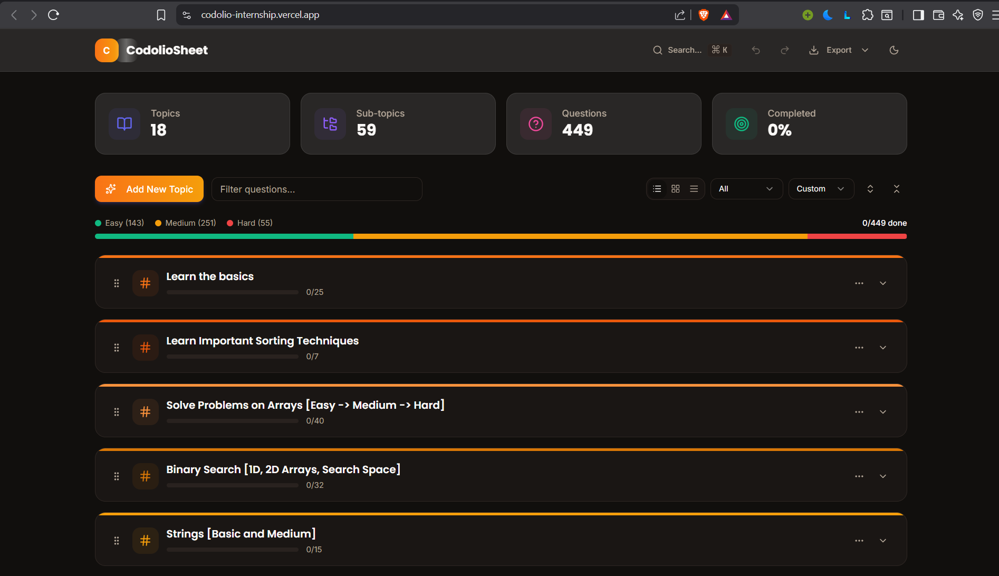

# CodolioSheet - DSA Question Tracker

A modern, feature-rich web application for tracking Data Structures and Algorithms (DSA) interview preparation progress. Built with Next.js 16, TypeScript, and Tailwind CSS.


## 🌐 Live Demo

**[🚀 View Live Application](https://codolio-internship.vercel.app)**

## 📸 Demo Screenshots

### Dashboard Overview


### Question Management


## 🚀 Features

### Core Functionality
- **Topic Organization**: Create and manage multiple DSA topics with color-coded categorization
- **Sub-topic Management**: Break down topics into manageable sub-topics
- **Question Tracking**: Add, edit, and track individual questions with:
  - Difficulty levels (Easy, Medium, Hard)
  - External links to problem statements
  - Resource links and platform information
  - Personal notes and solutions
  - Completion status

### User Experience
- **Multiple View Modes**: Switch between List, Kanban (Grid), and Compact views
- **Advanced Filtering**: Filter questions by difficulty, completion status, or search query
- **Smart Sorting**: Sort topics alphabetically or by progress
- **Progress Tracking**: Visual progress bars and statistics dashboard
- **Undo/Redo**: Full history management with keyboard shortcuts
- **Command Palette**: Quick access to all features via keyboard (Cmd/Ctrl + K)
- **Dark Mode**: System-aware theme with manual toggle support

### Technical Features
- **Local Storage Persistence**: All data saved locally in the browser
- **Responsive Design**: Fully optimized for mobile, tablet, and desktop
- **Keyboard Shortcuts**: Power-user friendly with extensive keyboard support
- **Real-time Statistics**: Live dashboard showing completion rates and progress
- **Drag-and-Drop Reordering**: Easily reorganize topics with move up/down controls

## ️ Tech Stack

### Frontend
- **Framework**: [Next.js 16](https://nextjs.org/) with App Router
- **Language**: [TypeScript](https://www.typescriptlang.org/)
- **UI Library**: [React 19](https://react.dev/)
- **Styling**: [Tailwind CSS](https://tailwindcss.com/)
- **Component Library**: [Radix UI](https://www.radix-ui.com/)
- **State Management**: [Zustand](https://zustand-demo.pmnd.rs/)
- **Icons**: [Lucide React](https://lucide.dev/)
- **Notifications**: [Sonner](https://sonner.emilkowal.ski/)

### Development Tools
- **Package Manager**: npm/pnpm
- **Linting**: ESLint
- **Fonts**: Google Fonts (Inter, Poppins, JetBrains Mono)

## 📦 Installation

### Prerequisites
- Node.js 18.x or higher
- npm or pnpm package manager

### Setup Instructions

1. **Clone the repository**
   ```bash
   git clone <repository-url>
   cd codolio-sheet
   ```

2. **Install dependencies**
   ```bash
   npm install
   ```

3. **Run the development server**
   ```bash
   npm run dev
   ```

4. **Open in browser**
   Navigate to [http://localhost:3000](http://localhost:3000)

## 🎯 Usage

### Getting Started
1. **Create a Topic**: Click "Add New Topic" or press `n` to create your first topic
2. **Add Sub-topics**: Use the dropdown menu on each topic to add sub-topics
3. **Add Questions**: Click the `+` icon next to any sub-topic to add questions
4. **Track Progress**: Check off questions as you complete them
5. **Filter & Search**: Use the toolbar to filter by difficulty or search for specific questions

### Keyboard Shortcuts
- `Cmd/Ctrl + K`: Open command palette
- `n`: Create new topic
- `Cmd/Ctrl + Z`: Undo last action
- `Cmd/Ctrl + Shift + Z`: Redo last action
- `Escape`: Close modals and cancel inputs

### Data Management
- All data is automatically saved to browser's localStorage
- Export/import functionality for backup and transfer
- Undo/Redo history maintained for the last 30 actions

## 🏗️ Project Structure

```
codolio-sheet/
├── app/
│   ├── api/              # API routes
│   ├── globals.css       # Global styles
│   ├── layout.tsx        # Root layout
│   └── page.tsx          # Main dashboard page
├── components/
│   ├── ui/               # Reusable UI components (Radix UI)
│   ├── navbar.tsx        # Navigation bar
│   ├── topic-card.tsx    # Topic display component
│   ├── question-item.tsx # Question display component
│   └── ...               # Other components
├── lib/
│   ├── store.ts          # Zustand state management
│   ├── types.ts          # TypeScript type definitions
│   └── utils.ts          # Utility functions
├── public/               # Static assets
└── styles/               # Additional styles
```

## 🔧 Configuration

### Customization
- **Colors**: Modify topic colors in `lib/store.ts` (`TOPIC_COLORS` array)
- **Theme**: Customize theme variables in `app/globals.css`
- **Fonts**: Update font imports in `app/layout.tsx`

### Environment Variables
No environment variables are required for basic functionality. All data is stored locally.

## 📊 Features in Detail

### Statistics Dashboard
- Total topics, sub-topics, and questions
- Overall completion percentage
- Breakdown by difficulty level
- Visual progress indicators

### Filtering System
- **By Difficulty**: Easy, Medium, Hard
- **By Status**: Completed, Incomplete
- **By Search**: Real-time search across questions and sub-topics

### View Modes
1. **List View**: Detailed vertical layout with full information
2. **Kanban View**: Grid-based layout for visual organization
3. **Compact View**: Condensed layout for maximum information density

## 🚢 Deployment

### Build for Production
```bash
npm run build
```

### Start Production Server
```bash
npm start
```

### Deploy to Vercel
The easiest way to deploy is using [Vercel](https://vercel.com):

```bash
npm install -g vercel
vercel
```

Alternatively, connect your GitHub repository to Vercel for automatic deployments.

### Deploy to Other Platforms
This is a standard Next.js application and can be deployed to:
- Netlify
- AWS Amplify
- Google Cloud Platform
- Self-hosted with Node.js

## 🤝 Contributing

Contributions are welcome! Please follow these steps:

1. Fork the repository
2. Create a feature branch (`git checkout -b feature/amazing-feature`)
3. Commit your changes (`git commit -m 'Add amazing feature'`)
4. Push to the branch (`git push origin feature/amazing-feature`)
5. Open a Pull Request

### Development Guidelines
- Follow the existing code style
- Write meaningful commit messages
- Update documentation for new features
- Test thoroughly before submitting

## 📝 License

This project is licensed under the MIT License - see the [LICENSE](LICENSE) file for details.

## 🙏 Acknowledgments

- UI components powered by [Radix UI](https://www.radix-ui.com/)
- Icons from [Lucide](https://lucide.dev/)
- Inspired by popular DSA preparation sheets (Striver A2Z, NeetCode, etc.)

## 📧 Contact

For questions, suggestions, or issues, please open an issue on GitHub.

---

**Built with ❤️ for the coding interview preparation community**
